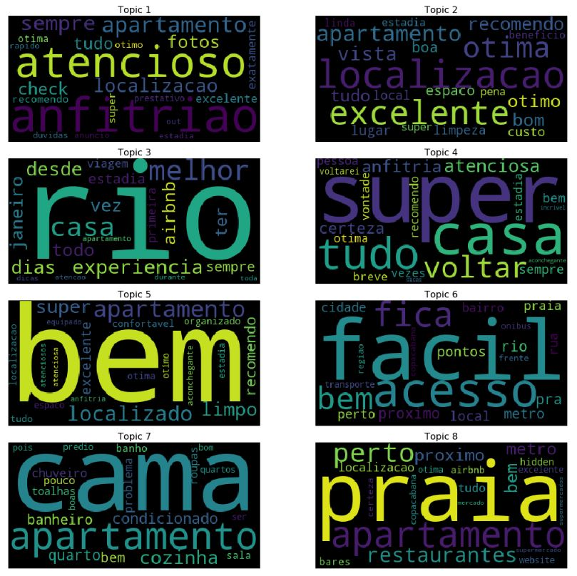

# Clustering AirBnb Reviews with LDA

This project implements a topic modelling analysis using an implementation of the LDA (Latent Dirichlet Allocation) algorithm, through the gensim package.

I used a dataset provided from Airbnb http://insideairbnb.com/get-the-data.html, containing reviews about Rio de Janeiro apartments.

The goal of this project was simply to use LDA as a way to cluster the reviews and find different topics on them.

## Methodology

The analysis consists of the following steps:

* Cleaning the dataset
* Filtering only portuguese reviews (*langdetect* package was used to detect the languages for each review)
* Preprocessing trials: lemmatization, stemming, standardization (accents, lowercase)
* Dataset preparation: Bag of Words generation 
* LDA: apply LDA for different number of topics
* Validation: select model with best *Coherence* metric
* Visualization and interpretation of topics

## Why LDA?

LDA is a very known method for topic modelling. As an unsupervised model, it depends only on the documents itself. It basically counts the frequency and the co-occurence of words in the same documents to find the mixture distributions of topics for each document.

Another approach I thought about using was to convert documents to numerical data using word embeddings (like Glove, FastText, etc..) and then apply any traditional clustering technique like K-means. This is also a known approach for topic modelling, but it does not show good performance for large documents, which was the case here.

## Model selection and validation

Validation for clustering is a very difficult task. Differently from supervised models, we don't have a true answer, so we have to find metrics to guide us into a way to find the optimal number of clusters.

In this analysis, we based the selection of the number of topics in two metrics:

* Perplexity: Intuitively, it is a measure of how well the probability model generated from LDA can predict the words that will appear in each document based on the document's topic.

* Coherence: Intuitively, it can be understood as how likely is any two words *i* and *j* appear together in the same document, considering they are very frequent words for the same topic *T*.

These metrics are helpful but manual inspection is the actual way to validate if the clusters generated make sense.

#### Preview of results
Below I'll be describing the results found in the analyis. 8 different topics were found and the difference between them can be easily understood by checking its word distributions. The LDA model with 8 topics had the best perplexity and best coherence score. Also, in the end, I applied several K-means models on the topic distribution generated by the LDA model. Coincidence or not, by checking the Elbow curve, the best K is again 8, which gives me more evidence that the model selection was appropriate.

### Results

* By inspecting each cluster, we got the following topics:

    * **Topic 1:** **great host (male)** positive recommendations about the host, the host is a men (male adjectives)
    * **Topic 2:** **great apartment** positive recommendations about the apartment (the view, cleaness, cost benefit, "it is worth")
    * **Topic 3:** **great experience in Rio de Janeiro** positive comments about the experience in Rio de Janeiro, the trip, the moments and experiences lived in this trip
    * **Topic 4:** **great host (female)** positive recommendations about the host, the host is a men (female adjectives)
    * **Topic 5:** **positive review in general** general good recommendations (including the host, the apartment, the location, etc..)
    * **Topic 6:** **good mobility, ease of access** comments about the location mainly, how it is close to everything, easy access, walking distance, public transportation, metro, uber, etc..
    * **Topic 7:** **complaints about the apartment** comments especifically about the furniture of the apartment and it seems to be mainly complaints about AC, the kitchen, the bed, towerls, water, internet, etc.. 
    * **Topic 8:** **location and nearby facilities**comments about location as well, but mainly describing the facilities nearby and the proximity to restaurants, grocery stores, banks, pharmacies,bakeries, etc.. 

* I ran the analysis on a sample of 100.000 portuguese reviews made from 2010 to 2019.

* I used a simpler model, without n-grams, lemmatization nor stemming. But certainly, these approaches could enhance the final result.

* Best number of topics: Coherence score for LDA models, varying number of topics from 2 to 16:

* 8 clusters visualized in a 2-D space:

* Wordcloud per topic generated by the most important words of each topic:

* Wordcloud per topic generated by all the words of each topic:

* K-means analysis on topic distributions - Best k = 8:

